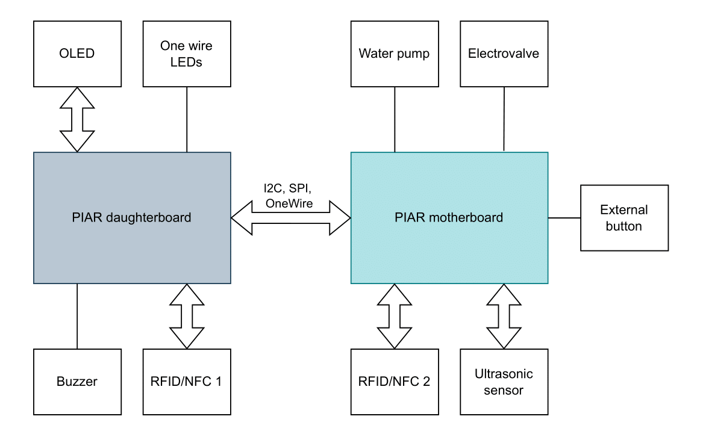

Projekt inteligentnego dystrybutora wody realizowany w zespole trójosobowym w ramach przedmiotu Prototypowanie Inżynierskie w Automatyce i Robotyce.
Cały system składał się z jednostki dystrybutora wody, aplikacji mobilnej oraz backendu z bazą danych.

Elektronika w ramach dystrybutora została podzielona na 2 moduły:
- **moduł centralny (motherboard)** - wyposażony w ESP32 i odpowiedzialny za sterowanie wszystkimi systemami dystrybutora oraz komunikacją bezprzewodową
- **moduł panela przednieggo (daughterboard)** - płytka zawierająca elementy odpowiadające za interakcję z użytkownikiem (wyświetlacz, ledy, buzzer, czujnik NFC)

Schemat połączeń został przedstawiony poniżej:



    
