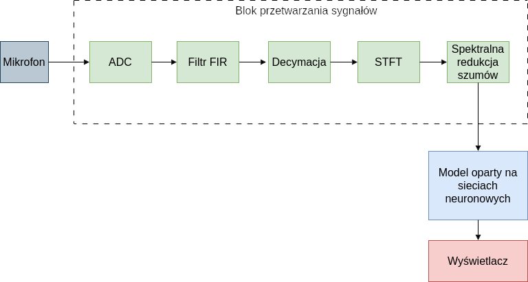
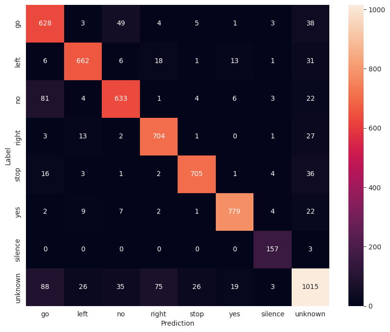
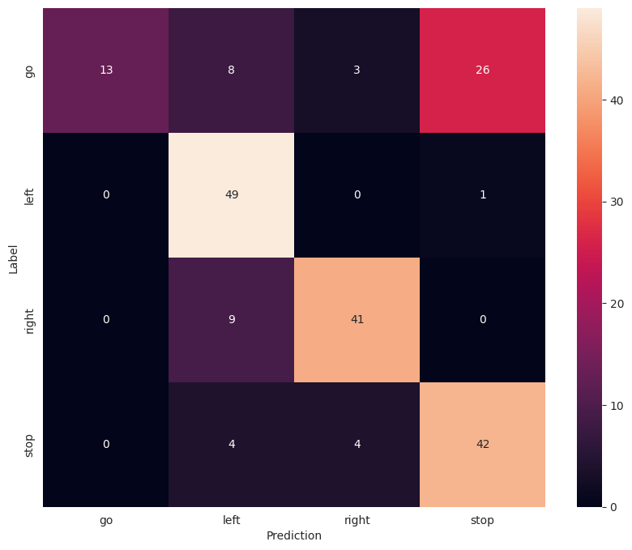

The SpeechRecognition project, developed as part of the Digital Signal Processing Techniques course, aimed to create a simple EdgeAI system capable of classifying basic voice commands such as left, right, stop, and go using a neural network deployed on an STM32 microcontroller.

At the beginning, the architecture of the entire system was defined, which includes three main components:
- Signal acquisition (analog microphone and sampling using ADC)
- Audio preprocessing (filtering, decimation to 8kHz, conversion to spectrogram, and spectral noise reduction)
- Spectrogram classification

The neural network was trained offline using the TensorFlow library on the Speech Commands dataset. Below is the confusion matrix for the best-performing model on the test data.

The best model was then fine-tuned using samples recorded from the target microphone connected to the microcontroller. The number of output classes was reduced to 4. Before deployment to the STM32 microcontroller using the X-Cube-AI tool, the network was further optimized and quantized.

Below is the confusion matrix showing the results of system-level tests.

The system’s performance could be improved by using a MEMS microphone with a digital I2S interface, increasing the audio sampling rate to `fs = 16kHz`
and deploying on a microcontroller with more available SRAM memory.
